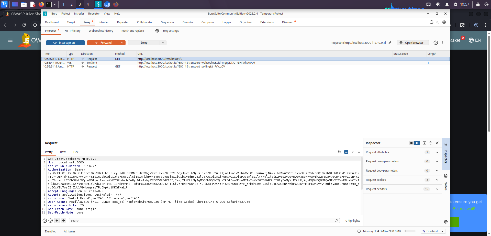
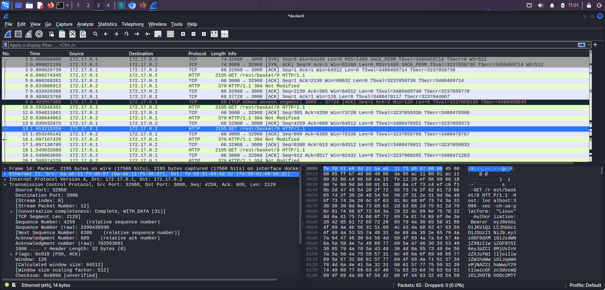

# TASK-2 EVIDENCE SUMMARY

**Name:** Souvik Das
**Task:** Build Your Personal Cybersecurity Lab (Task-2)
**Company:** Maincrafts Technology

---

# 1. VM LIST

**Virtual Machine:** Kali Linux

| Parameter | Value           |
| --------- | --------------- |
| RAM       | 4096 MB         |
| CPU       | 4 CPUs          |
| Network   | NAT + Host-Only |

---

# 2. IP CONFIGURATION

**Command**

```bash
ip addr
```

**Result**

| Interface | IP Address |
| --------- | ---------- |
| eth0      | 10.0.2.15  |
| docker0   | 172.17.0.1 |

---

# 3. PING VALIDATION

**Command**

```bash
ping -c 4 172.17.0.1
```

**Result**

* 4 Packets Sent
* 4 Packets Received
* 0% Packet Loss

---

# 4. NMAP VALIDATION

**Command**

```bash
sudo nmap -sn 172.17.0.1
```

**Result**

* Host Status: Up
* Active Hosts: 1

---

# 5. BURP SUITE SCREENSHOT

**Captured Request**

```http
GET /rest/basket/0 HTTP/1.1
```

---

# 6. WIRESHARK SCREENSHOT

**Protocols Observed**

* TCP
* HTTP

